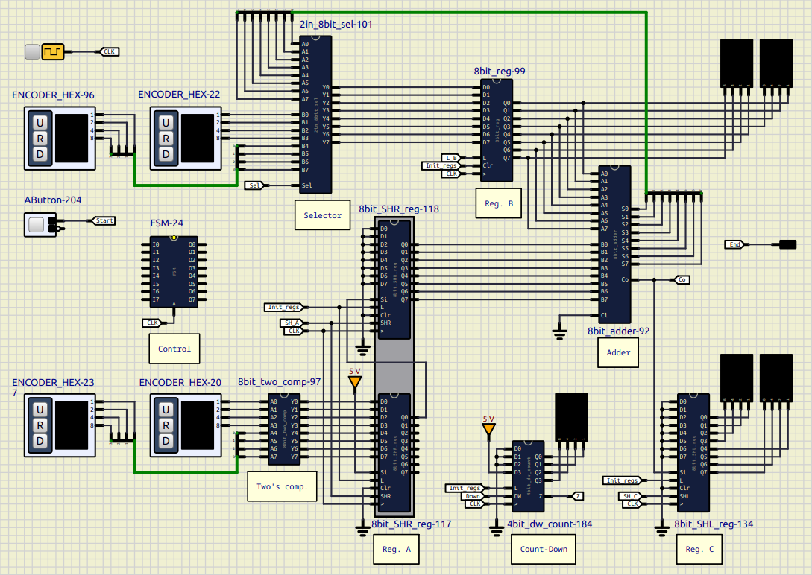

# 8-bit Sequential Divider Simulation

This example implements a digital 8-bit sequential divider simulation on [SimulIDE](https://simulide.com/p/), it is composed by:

- dual 8-bit (16-bit) parallel input shift-right registers (subcircuits)
- 8-bit parallel output shift-left register (subcircuit)
- 8-bit parallel load register (subcircuit)
- 4-bit zero comparator
- 8-bit adder (subcircuit)
- 8-bit 2 inputs selector/multiplexer
- 8-bit Two's complement module
- 4-bit down counter
- FSM Finite State Machine as control block (script) [readme file (similar example)](/FSM/README.md)

you can also see this [tutorial](https://youtu.be/PAcU9CNJh7A?si=TVzpL2JlhtzKox_8) (spanish) about a similar circuit.

This is done as a teaching exercise in _SimulIDE_, for users to implement the Control Unit (FSM) of the divider by themselves.

## Usage 
You have to copy all the component's folders inside a one in the user data folder, for instance `~/User_data/test`and associate it in Simulide.
You can see how to do this in the official SimulIDE's Tutorials:
[User data folder SimulIDE 1.1.0](https://www.youtube.com/watch?v=pAU7fdUWCqs)
[Crear Componentes SimulIDE 1.1.0 ](https://www.youtube.com/watch?v=LBknR6y5Qho) (Spanish)